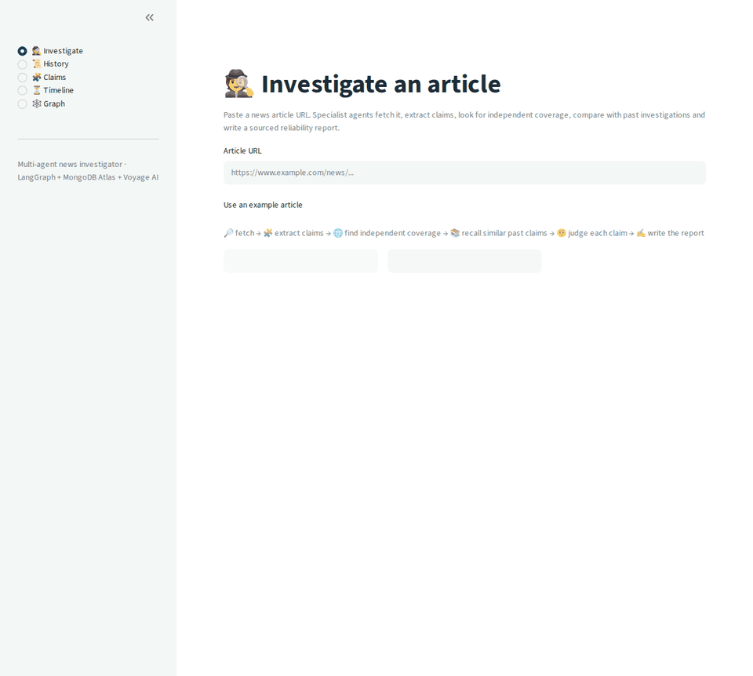
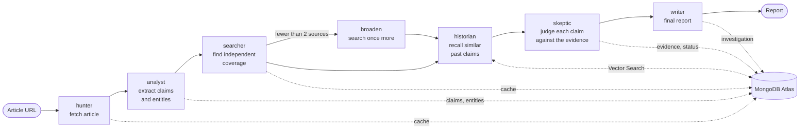
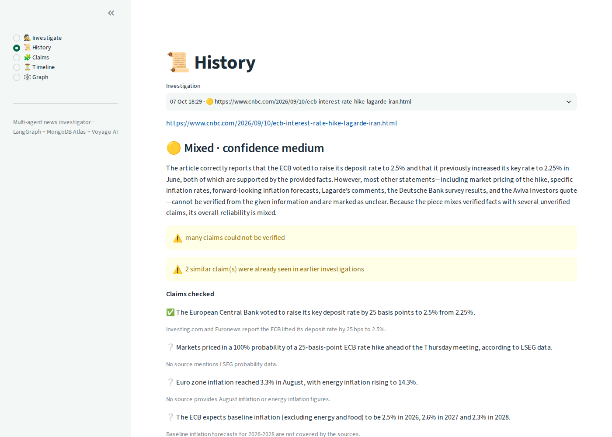
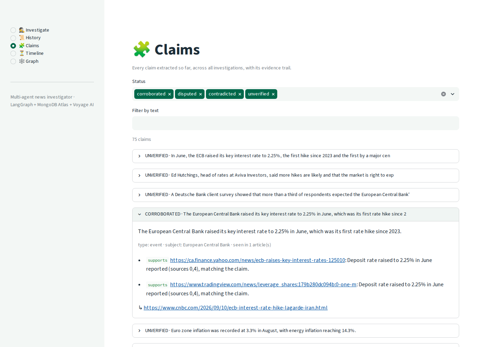
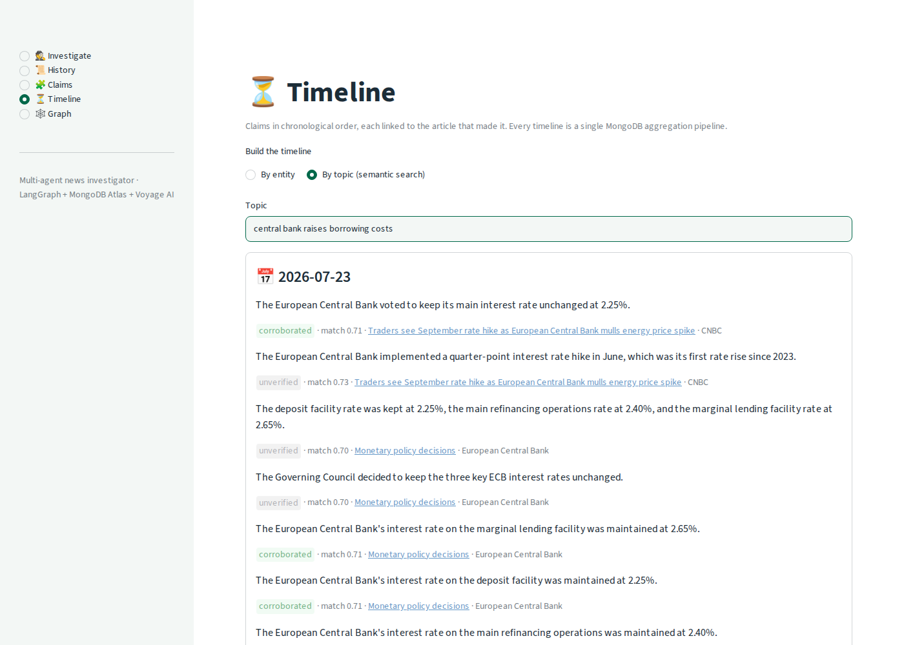
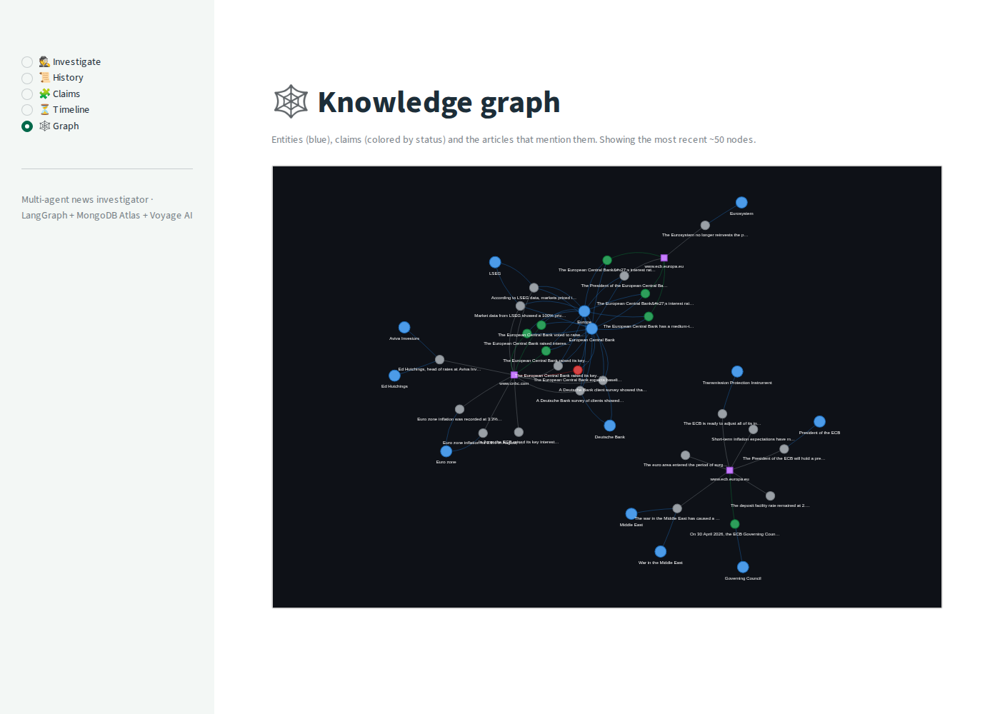

# Multi-Agent News Investigator

**Paste a news article URL. A team of specialist AI agents reads it, extracts its claims, looks for independent coverage, remembers what it has seen before, and writes a sourced reliability report.**

Built with **LangGraph**, **MongoDB Atlas** (including **Vector Search**), **Voyage AI** embeddings and a **free-tier-only** mix of cloud and local LLMs.



## Why this isn't "just ChatGPT"

- **It is grounded in evidence, not in the model's memory.** Each claim is judged only against sources retrieved for that investigation. If the sources don't address a claim, the verdict is *unclear*, not a guess. ([`graph.py`](src/investigator/graph.py), `skeptic`)
- **It has memory.** Claims and their evidence are stored in MongoDB with vector embeddings. A new article on the same story recalls what earlier investigations found, matched by *meaning*, not keywords. ([`memory.py`](src/investigator/memory.py))
- **It is built for the free-tier reality.** Three LLM providers with automatic fallback, timeouts, caching of every article and search, and a credit counter that stops before a quota runs out. ([`llm.py`](src/investigator/llm.py), [`tools/search.py`](src/investigator/tools/search.py))
- **It degrades instead of crashing.** If one step fails, the error is recorded and the investigation continues with what it has.

## How it works



The agents share one state object. Each node reads it and returns only what it changes. A conditional edge adds one extra search when coverage is thin.

**Searching with claims, not titles.** An early version searched with the article title and found irrelevant pages. Extracting claims *first* and searching with those gave real corroborating coverage, so the graph is ordered that way.

### In the app

| Report | Claims and their evidence trail |
|---|---|
|  |  |
| **Timeline** (one MongoDB aggregation pipeline) | **Knowledge graph** |
|  |  |

Blue = entities, green = corroborated claims, grey = unverified claims, purple squares = articles.

### What is stored in MongoDB

| Collection | Holds | Notes |
|---|---|---|
| `articles` | fetched article text and metadata | unique index on `url`; upserts mean re-fetching never duplicates |
| `claims` | checkable statements, status, evidence, embedding | status: `unverified → corroborated / disputed / contradicted`; **Atlas Vector Search** index `claims_vector` (1024 dims, cosine) |
| `entities` | people, organisations, places | deduplicated by normalised name |
| `searches` | cached search results (7 days) | protects the scarce search quota |
| `usage` | monthly search-credit counter | the tool refuses to search past the budget |
| `investigations` | one document per run: steps, report, sources, memory | steps are saved as they happen, so a crash leaves a partial record |

### Why a document database suits this kind of agent workload

Notes from building it, not a sales pitch:

- **One store for state, memory and vectors.** A claim is one document holding its text, status, evidence trail *and* its embedding. There is no separate vector database to keep in sync, and `$vectorSearch` is just another stage in an ordinary aggregation pipeline.
- **Semantic search and normal queries in the same query.** The Timeline page runs `$vectorSearch → $lookup → $sort` as a single pipeline: find claims by meaning, join them to the articles that made them, order them by date.
- **A flexible schema matches evolving agent state.** An investigation document grows as each agent step streams in, and the claim schema gained fields (`variants`, evidence, memory) several times during development without a single migration.
- **Upserts and unique indexes make agent work idempotent.** Retried steps and repeated URLs never create duplicates, which is what makes aggressive caching safe.
- **Good embeddings matter, with caveats.** Voyage AI's `voyage-4-lite` (1024 dimensions) matched "Eurozone central bank hikes borrowing costs" to an ECB rate claim sharing no keywords. It is weak on exact figures, though, which is why claim deduplication adds a numbers check and an LLM judge.

### Timelines are one aggregation pipeline

The Timeline page shows the pipeline it ran ("Show the MongoDB pipeline behind this page"). The semantic version, simplified:

```text
$vectorSearch   claims closest in meaning to the topic you typed
$match          keep strong matches
$unwind         one event per (claim, article) pair
$lookup         join each event to its article (title, source, publication date)
$sort           chronological order
```

Code: [`timeline.py`](src/investigator/timeline.py).

### Semantic claim deduplication

The same fact is often worded differently by different articles. New claims are compared with stored ones by embedding similarity, with three bands chosen from real data ([`dedup.py`](src/investigator/dedup.py)):

| Similarity (cosine) | Decision |
|---|---|
| ≥ 0.985 and identical numbers | merged automatically |
| 0.93 – 0.985 | a strict LLM judge decides: *exactly* the same facts, or not |
| < 0.93 | kept separate |

The number check exists because embeddings are weak on figures: "2.5%" and "2.75%" must never be merged. A merged claim keeps the other wording as a variant and lists every article that made it. `uv run python -m investigator.dedup` shows (and with `--apply` performs) a clean-up of older duplicates.

### LLM routing

Two tiers, each with a fallback chain, so a rate limit (HTTP 429) or outage never stops a run:

| Tier | 1st | 2nd | 3rd (local) |
|---|---|---|---|
| cheap | Gemini 3.5 Flash-Lite | Groq `gpt-oss-20b` | Mistral `ministral-3:3b` (local, via Ollama) |
| smart (extraction, verification, report) | Gemini 3.5 Flash | Groq `gpt-oss-120b` | Mistral `ministral-3:3b` (local, via Ollama) |

**Local model:** the last link of the chain is a [Mistral](https://mistral.ai) model running on your own machine through Ollama, so the project keeps working offline or when every cloud quota is used up. The default is `ministral-3:3b`, Mistral's small model, which is light enough for a laptop. Any other Ollama model, such as the larger `mistral` (7B), can be used by changing `OLLAMA_MODEL` in `.env`. It is slow on a CPU, so it is a safety net, not the main path.

Every provider call has a hard deadline, because client-library timeouts are not always enforced: a stuck call is abandoned and the next provider takes over. Structured output (Pydantic schemas) is applied per provider before the fallbacks are chained.

## Stack

| Piece | Choice |
|---|---|
| Agents | LangGraph, LangChain |
| Database and memory | MongoDB Atlas free tier (M0) + Atlas Vector Search |
| Embeddings | Voyage AI `voyage-4-lite` (1024 dims) |
| Cloud LLMs | Gemini (primary), Groq (fallback) |
| Local LLM | Mistral, run locally with Ollama (last-resort fallback, no quota) |
| Web search | Tavily (free tier) |
| Article extraction | trafilatura |
| UI | Streamlit, pyvis (knowledge graph) |
| Packaging | uv |

## Quickstart

You need Python 3.12+, [uv](https://docs.astral.sh/uv/) and free accounts for: MongoDB Atlas (M0 cluster), Google AI Studio (Gemini), Groq, Tavily and Voyage AI (a model API key from Atlas works). [Ollama](https://ollama.com) with a Mistral model (`ollama pull ministral-3:3b`) is optional but recommended as the local fallback.

```bash
git clone https://github.com/youenn-creach/multi-agent-news-investigator-mongodb.git
cd multi-agent-news-investigator-mongodb
uv sync

cp .env.example .env        # then fill in your keys and MONGODB_URI
uv run python -m investigator.setup     # creates the MongoDB indexes (first run: 1-2 min)
```

Then either:

```bash
uv run streamlit run app.py                 # web UI
uv run python -m investigator.cli "<article-url>"   # command line
```

**Notes**
- In Atlas, allow your current IP address under *Network Access*, or the connection will time out.
- The Voyage free tier is rate-limited; the code waits and retries automatically.
- `.env` is gitignored. Never commit it.

## Project layout

```
app.py                      Streamlit UI (investigate, history, claims, timeline, graph)
src/investigator/
  llm.py                    tiered LLM routing with fallbacks and hard deadlines
  graph.py                  the LangGraph pipeline (nodes, edges, state)
  investigation.py          runs the graph and persists progress
  extraction.py             claims and entities (Pydantic schemas, prompts)
  memory.py                 Atlas Vector Search over claims
  dedup.py                  semantic claim deduplication
  timeline.py               timelines as MongoDB aggregation pipelines
  embeddings.py             Voyage AI client with retry
  db.py                     MongoDB access
  tools/articles.py         fetch + cache an article
  tools/search.py           Tavily search + cache + credit counter
  cli.py, setup.py          command-line entry points
scratch/                    small numbered scripts used to test each piece
LEARNING_LOG.md             what I learned, one line per session
docs/PLAN.md                the original learning plan
```

## Limitations (honest ones)

- **Verification uses search snippets, not full source articles.** Good enough to confirm headline facts, weak for detailed numbers. Many claims end up *unclear*, which is the intended behaviour but means reports are often *mixed*.
- **Claim deduplication is deliberately conservative.** Claims are merged only when they are near-identical in meaning and numbers, so some real duplicates stay separate rather than risk merging two different claims.
- **Source quality is not scored.** A snippet from a blog and one from a central bank count the same.
- **Paywalled or JavaScript-only pages** can't be read; the report then says so.
- **No authentication.** It is meant to run locally; exposing it publicly would let anyone spend the free-tier quotas.
- Free-tier model names and quotas change often; the cascade exists partly because of that.

## Roadmap

- Source-reliability scoring learned from past evidence
- Scheduled re-checking of unverified claims
- Evaluation set to measure extraction and verdict quality

## How it was built

Built step by step with [Claude Code](https://claude.com/claude-code) as a learning project about agentic architecture. [`LEARNING_LOG.md`](LEARNING_LOG.md) records what was learned at each step, and [`docs/PLAN.md`](docs/PLAN.md) holds the original plan.
